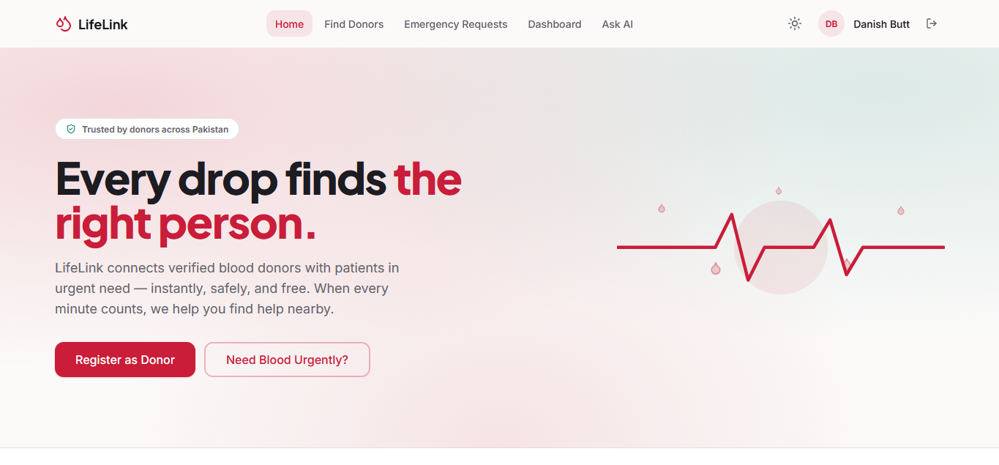
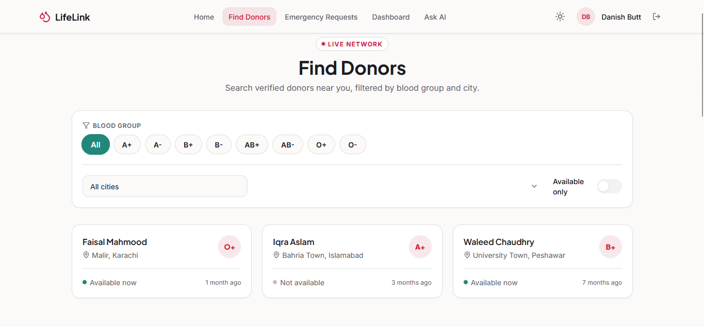
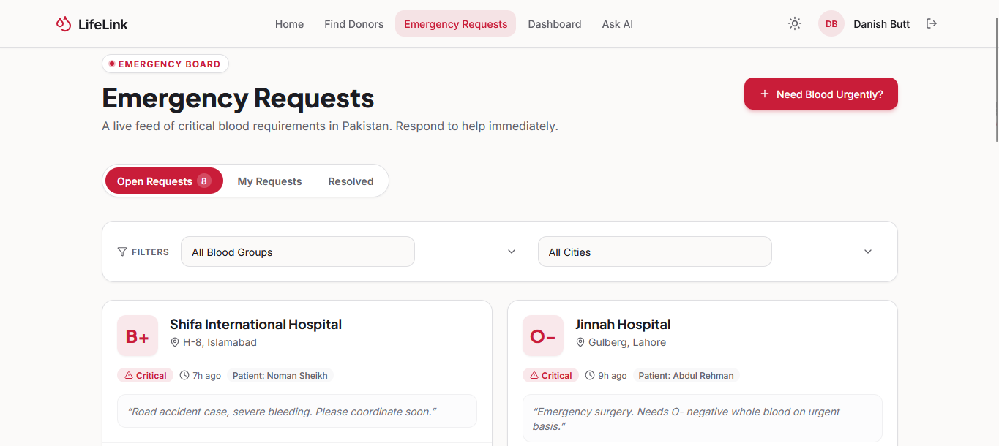
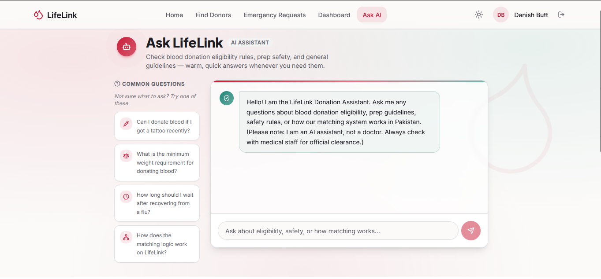
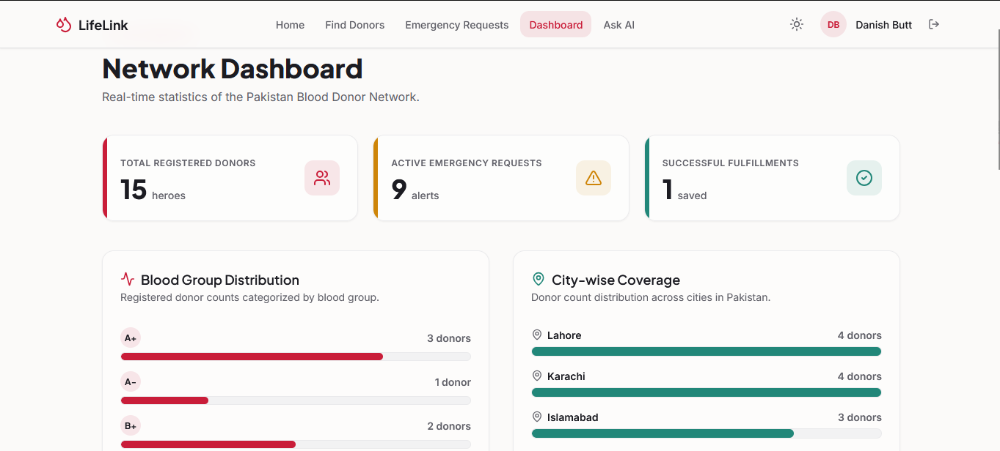
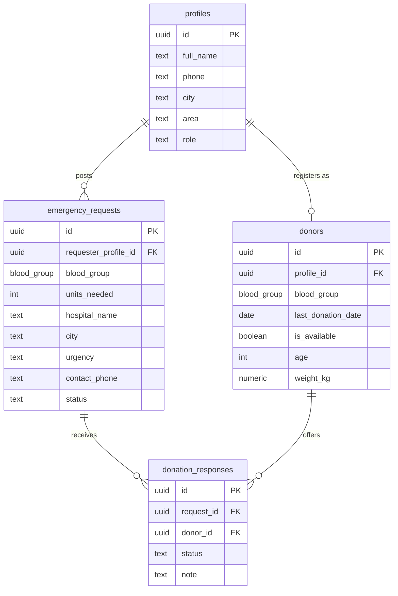

<div align="center">

# 🩸 LifeLink

### Blood Donor Emergency Network

**Connecting blood donors with the people who need them — faster, safer, and free.**

[](https://lifelink-blood-donor.vercel.app/)

<br />


</div>

---

## 📑 Table of Contents

- [The Problem & Who It's For](#-the-problem--who-its-for)
- [Live Demo](#-live-demo)
- [Features](#-features)
- [The AI Feature — Ask LifeLink](#-the-ai-feature--ask-lifelink)
- [Tech Stack & Tools](#️-tech-stack--tools)
- [Screenshots](#-screenshots)
- [Running Locally](#-running-locally)
- [Database Schema](#️-database-schema)
- [Project Structure](#-project-structure)

---

## 🚑 The Problem & Who It's For

In Pakistan, finding a blood donor during an emergency is often a race against the clock fought with the wrong tools. When a patient needs a specific blood group *right now*, families fall back on frantic WhatsApp group broadcasts, Facebook posts, and a chain of phone calls to friends-of-friends. Blood-bank inventories are frequently outdated or unreachable after hours, and there is no reliable way to know who nearby is both compatible **and** available to donate.

The result is wasted hours — the most critical hours — spent on coordination instead of care. A message forwarded across a dozen chats has no structure: no way to filter by blood group, no way to know a donor's location, and no way to protect anyone's privacy.

**LifeLink** replaces that chaos with a structured, real-time, city-based matching network. A requester posts an emergency once, and the platform instantly surfaces compatible, available donors in the same city — sorted by proximity — while a medically-aware AI assistant answers the eligibility questions that make people hesitate.

**LifeLink is built for three groups:**

| Audience | How LifeLink helps |
| --- | --- |
| 👨‍👩‍👧 **Patients' families & requesters** | Post an emergency request in seconds and see matching donors immediately, without begging across social media. |
| 🩸 **Voluntary blood donors** | Register once, stay private until needed, and respond to nearby emergencies you're actually compatible with. |
| 🌍 **The wider community** | A growing, transparent donor network with live analytics that make the culture of donation visible and sustainable. |

---

## 🔗 Live Demo

### 👉 **[https://lifelink-blood-donor.vercel.app/](https://lifelink-blood-donor.vercel.app/)**

**Try it in under two minutes:**

1. **Sign up** for a free account (as a *donor*, *requester*, or *both*).
2. **Browse Find Donors** — filter the directory by blood group and city.
3. **Post an emergency request** and watch LifeLink instantly list compatible, nearby donors.
4. **Ask LifeLink** — open the AI assistant and ask something like *"Can I donate if I got a tattoo last month?"*

> 💡 **The network comes pre-populated with demo data.** An optional seed migration loads 15 realistic Pakistani donors across cities like Karachi, Lahore, and Islamabad, 8 emergency requests spanning every urgency level, and a resolved case — so you can explore matching, filtering, and the live board without setting anything up first.

---

## ✨ Features

### 🔐 Authentication & Security

- **Email/password signup and login** powered by Supabase Auth.
- **Live password-strength requirements** — the signup form checks for an uppercase letter, a lowercase letter, a number, and a special character in real time, each lighting up green as it's satisfied.
- **Show / hide password toggle** built into every password field.
- **Strict, real-time validation** on name (letters only, min 3 chars), email format, and phone number.
- **Fixed `03` phone prefix** — the phone input locks the Pakistani mobile prefix and enforces exactly 11 digits.
- **Automatic profile creation** — a Postgres trigger (`handle_new_user`) creates a matching `profiles` row the moment a user signs up, reading the metadata passed at registration.
- **Protected routes** — donor registration and request creation redirect anonymous visitors to login, and a middleware layer refreshes the auth session on every request.

### 🩸 Donor Management

- **Guided registration** with medical eligibility validation: donors must be **18–65 years old** and **≥ 50 kg** to register safely (enforced in the form *and* as a database `CHECK` constraint).
- **Blood group chip selector** — an animated, tap-to-select control for all 8 groups.
- **Availability toggle** — a switch to mark yourself available or temporarily unavailable.
- **Last-donation date** with a friendly warning if it's been under 3 months.
- **Edit mode** — returning donors have their existing details pre-filled and can update in place (upsert).
- **Donor directory** with blood-group, city, and "available only" filters, **loading skeletons**, and thoughtful **empty states** (different messaging for "no matches" vs. "no donors yet").

### 🚨 Emergency Request System

- **Create a request** with patient name, blood group, units needed (stepper), hospital, city/area, contact phone, and one of three **urgency levels** — Critical, Urgent, or Planned.
- **Instant matching preview** — on submission, the request page runs the matching engine and shows compatible donors immediately, sorted by area proximity.
- **Live emergency board** via **Supabase Realtime** — the feed subscribes to database changes and refreshes automatically as new requests arrive or statuses change.
- **Smart sorting** — the board orders requests by urgency (Critical → Urgent → Planned), then by recency.
- **"Compatible Match" highlighting** — if you're a registered, available, non-cooldown donor whose blood group fits a request, that card is visually flagged with an animated shimmer ribbon.
- **Respond-as-donor modal** — runs a live compatibility check, lets you attach an optional note, and requires an explicit "Confirm Intent to Donate" checkbox before your contact details are shared.
- **Requester dashboard (My Requests)** — review every donor response, **reveal the donor's phone only after they respond**, and **Confirm** or **Decline** each offer.
- **Fulfillment flow** — mark a request fulfilled and trigger a full-screen **celebration animation** with a confetti burst; fulfilled cases move to a "Resolved / Life Saved" tab.

### 🧬 Biological Matching Engine

A real, medically-correct blood-compatibility engine written as **pure, fully-typed TypeScript** in [`lib/matching.ts`](lib/matching.ts) — no external dependency, no guesswork:

- **Donor → recipient compatibility chart** covering all 8 groups, including the two special cases: **O-** is the universal donor and **AB+** is the universal recipient.
- **90-day cooldown eligibility** — helpers compute whether a donor is eligible again and how many days remain.
- **City matching** as a hard filter, with results **sorted by area match first** (same neighbourhood ranks above same-city), then by who has been available the longest.

### 🤖 AI Eligibility Assistant

**Ask LifeLink** — a medically-guarded chat assistant that answers donation eligibility, safety, and preparation questions. See the [dedicated section below](#-the-ai-feature--ask-lifelink).

### 📊 Dashboard & Analytics

- **Live counters** for total registered donors, total requests, and successful fulfillments — each with an animated count-up.
- **Blood group distribution** — an animated bar chart of registered donors per group.
- **City-wise coverage** — a ranked breakdown of donors across Pakistani cities.

### 🎨 UI / UX

- **Light mode by default with a full dark mode**, persisted via cookie and read server-side so there's **no flash of the wrong theme** on load.
- **Glassmorphism navbar** with a backdrop blur and a scroll-aware shadow.
- **Framer Motion** micro-animations throughout — page transitions, staggered card reveals, animated tab pills, and celebration effects.
- **Fully responsive, mobile-first** layouts with a dedicated mobile navigation drawer.
- **Accessibility considerations** — semantic labels, `aria-*` attributes, focus-visible rings, and `aria-live` regions on dynamic content.

### 🛡️ Privacy & Security

- **Row Level Security (RLS)** enabled on every table, with policies scoping inserts and updates to the owning user.
- **Security-barrier views** (`profiles_secure`, `emergency_requests_secure`) that mask phone numbers at the database level — a contact number is only exposed once a genuine donation-response connection exists between the two parties.
- **No secrets in the repository** — all keys live in environment variables, with a committed `.env.local.example` template.

---

## 💬 The AI Feature — Ask LifeLink

> **Ask LifeLink — AI Eligibility Assistant**

Many people hesitate to donate not because they're unwilling, but because they're unsure whether they *qualify* — "Can I donate after a tattoo?", "Is my weight enough?", "How long after the flu?" **Ask LifeLink** answers exactly these questions, warmly and quickly, so uncertainty never costs someone a donation.

### What it does

- Answers **blood-donation eligibility, safety, and preparation** questions with sensible medical guardrails.
- **Refuses off-topic queries** and politely redirects back to donation topics.
- **Never diagnoses** — it explicitly states it isn't a doctor and always advises confirming any specific condition with blood-bank staff or a physician.
- **Never fabricates** statistics, hospital names, or personal donor records.
- Ships with **preset starter questions** and renders replies as clean formatted lists, and each user's chat history is preserved locally between visits.

### Multi-provider architecture

The assistant is served entirely from a **server-side API route** at [`app/api/chat/route.ts`](app/api/chat/route.ts) — the API key never touches the browser. The endpoint is **provider-agnostic**:

- It **auto-detects the provider** from the API key format: a key beginning with `sk-ant-` routes to **Anthropic Claude** (`claude-3-5-sonnet-20241022`); any other key routes to **Google Gemini** (`gemini-3.5-flash`).
- It **sanitises conversation history** into a strict alternating user/assistant sequence before sending.
- It includes **retry logic with exponential backoff** — on a `429` (rate limit) or `503` (service busy), it waits and retries with an increasing delay before surfacing a friendly error.

### The system prompt (verbatim from the code)

```text
You are the LifeLink Donation Assistant, a helpful and careful assistant embedded in a Pakistani blood donor network app. Your ONLY job is to answer questions about blood donation eligibility, general safety, preparation before/after donating, and how the LifeLink app works. Guidelines you must follow:
1. Give general, widely-accepted donation eligibility guidance (e.g., typical minimum age 17-18, minimum weight ~50kg, waiting periods after illness, medication, tattoos, pregnancy, or recent donation — roughly 90 days between whole blood donations).
2. Always clarify you are not a doctor and cannot give a personal medical diagnosis or clearance — for any specific health condition, medication, or symptom the user mentions, advise them to confirm with the blood bank staff or their doctor before donating.
3. Be warm, concise, and reassuring — many users asking are anxious about whether they qualify to help someone in an emergency.
4. If asked about anything unrelated to blood donation or the app, politely redirect back to donation-related topics.
5. Never make up specific statistics, hospital names, or claim to access the user's personal donor record — you only give general guidance.
```

### Example conversations

> **🙋 User:** Can I donate blood if I got a tattoo recently?
>
> **🤖 Ask LifeLink:** Great question! Most guidelines recommend waiting around **3 to 6 months** after getting a tattoo before donating, mainly as a precaution against blood-borne infections. The exact waiting period can depend on where and how the tattoo was done. Since this varies, please **confirm the current waiting time with your blood bank** before you go — but it's wonderful that you're planning to donate! 🩸

> **🙋 User:** What's the weather like today?
>
> **🤖 Ask LifeLink:** I'm here specifically to help with **blood donation** questions — eligibility, preparation, safety, and how LifeLink works. Is there anything about donating I can help you with? For example, I can tell you about weight or age requirements. 😊

---

## 🛠️ Tech Stack & Tools

| Layer | Technology | Purpose |
| --- | --- | --- |
| **Framework** | [Next.js 16](https://nextjs.org/) (App Router) + [React 19](https://react.dev/) | Full-stack framework with server components and API routes |
| **Language** | [TypeScript](https://www.typescriptlang.org/) | End-to-end type safety across UI, domain types, and matching logic |
| **Styling** | [Tailwind CSS](https://tailwindcss.com/) | Utility-first styling with a custom light/dark design system |
| **Animation** | [Framer Motion](https://www.framer.com/motion/) | Page transitions, card reveals, and celebration effects |
| **Icons** | [Lucide React](https://lucide.dev/) | Consistent, lightweight icon set |
| **Database** | [Supabase Postgres](https://supabase.com/database) | Relational store for profiles, donors, requests, and responses |
| **Auth** | [Supabase Auth](https://supabase.com/auth) | Email/password auth with an auto profile-creation trigger |
| **Realtime** | [Supabase Realtime](https://supabase.com/realtime) | Live emergency board that updates without a refresh |
| **AI models** | **Anthropic Claude** (`claude-3-5-sonnet-20241022`) **& Google Gemini** (`gemini-3.5-flash`) | Medically-guarded eligibility assistant via a single multi-provider endpoint |
| **Hosting** | [Vercel](https://vercel.com/) | Continuous deployment and edge-served hosting |

> 🧑‍💻 **A note on tooling:** LifeLink was built with the assistance of **[Claude Code](https://claude.com/claude-code)** as the AI pair-programming tool. The assignment permits any tools, and this is noted here in the interest of full transparency.

---

## 📸 Screenshots

| | |
| :---: | :---: |
|  |  |
| **Landing page** — hero, live stats, and how it works | **Find Donors** — filterable donor directory |
|  |  |
| **Emergency Requests** — live board with match highlighting | **Ask LifeLink** — the AI eligibility assistant |

<div align="center">



**Dashboard** — live counters and blood-group / city analytics

</div>

> **📝 TODO — capture these 5 screenshots and drop them into a `screenshots/` folder in the repo root.** File names must match exactly for the images above to render:
>
> | Page to capture | Save as |
> | --- | --- |
> | Landing / home page (`/`) | `screenshots/landing.png` |
> | Find Donors page (`/donors`) | `screenshots/donors.png` |
> | Emergency Requests board (`/requests`) | `screenshots/requests.png` |
> | Ask LifeLink AI chat (`/chat`) | `screenshots/chat.png` |
> | Network Dashboard (`/dashboard`) | `screenshots/dashboard.png` |

---

## 🚀 Running Locally

### Prerequisites

- **Node.js 18+** and npm
- A free **[Supabase](https://supabase.com/)** project
- An **Anthropic** *or* **Google Gemini** API key (for the AI assistant)

### 1. Clone the repository & install dependencies

```bash
git clone <your-repo-url>
cd lifelink
npm install
```

### 2. Set up the database

Create a Supabase project, open the **SQL Editor**, and run the migrations **in order**:

| Order | File | What it does |
| --- | --- | --- |
| 1 | [`supabase/migrations/0001_core_schema.sql`](supabase/migrations/0001_core_schema.sql) | Creates the `blood_group` enum, all four tables, indexes, RLS policies, and the signup → profile trigger. |
| 2 | [`supabase/migrations/0002_module3_updates.sql`](supabase/migrations/0002_module3_updates.sql) | Adds the response `note` column, the phone-masking secure views, the response-update policy, and enables Realtime. |
| 3 *(optional)* | [`supabase/migrations/0003_seed_demo_data.sql`](supabase/migrations/0003_seed_demo_data.sql) | Loads demo data — 15 Pakistani donors, 8 emergency requests, and 1 resolved case. Safe to skip or delete for production. |

### 3. Configure environment variables

Copy the template and fill in your values:

```bash
cp .env.local.example .env.local
```

| Variable | Where to get it |
| --- | --- |
| `NEXT_PUBLIC_SUPABASE_URL` | Supabase → **Project Settings → API** → Project URL |
| `NEXT_PUBLIC_SUPABASE_ANON_KEY` | Supabase → **Project Settings → API** → `anon` public key |
| `ANTHROPIC_API_KEY` | Your AI key. A key starting with `sk-ant-` uses **Claude**; any other value is treated as a **Google Gemini** key. |
| `SUPABASE_SERVICE_ROLE_KEY` | Supabase → **Project Settings → API** → `service_role` key *(server-only; keep secret)* |

### 4. Run the development server

```bash
npm run dev
```

Open **[http://localhost:3000](http://localhost:3000)** in your browser.

### ☁️ Deployment

LifeLink deploys cleanly to **Vercel**: import the repository, add the same four environment variables in the Vercel project settings, and deploy. Vercel auto-detects Next.js — no extra build configuration is required.

---

## 🗄️ Database Schema

Four core tables model the entire network. All tables have **Row Level Security enabled**, and two **security-barrier views** mask contact numbers until a legitimate connection exists.



| Table | Purpose |
| --- | --- |
| **`profiles`** | One row per user (created automatically on signup) holding name, phone, city, area, and role (`donor` / `requester` / `both`). |
| **`donors`** | A user's donor details — blood group, age, weight, last donation date, availability, and notes — with age (18–65) and weight (≥50kg) enforced as constraints. |
| **`emergency_requests`** | A posted blood request — blood group, units, hospital, location, urgency, contact, and status (`open` / `fulfilled` / `expired`). |
| **`donation_responses`** | A donor's offer against a request, with a status (`offered` / `confirmed` / `declined`) and an optional note; unique per donor-request pair. |

> **🔒 Privacy by design.** Rather than trusting the client to hide sensitive fields, phone numbers are masked in Postgres itself. The `profiles_secure` and `emergency_requests_secure` views return a contact number **only** when the viewer is the owner, or when a donation-response link already exists between the requester and the donor. The app reads exclusively from these secure views for any listing.

---

## 📁 Project Structure

```
lifelink/
├── app/                        # Next.js App Router
│   ├── (auth)/                 # Auth route group
│   │   ├── login/              # Login page
│   │   └── signup/             # Signup with live validation
│   ├── api/chat/route.ts       # Multi-provider AI endpoint (Claude + Gemini)
│   ├── chat/                   # "Ask LifeLink" AI assistant UI
│   ├── dashboard/              # Analytics & live counters
│   ├── donors/                 # Donor directory + registration
│   ├── requests/               # Emergency board, new request, my requests
│   ├── layout.tsx              # Root layout, providers, theme cookie
│   └── page.tsx                # Landing page
├── components/
│   ├── layout/                 # Navbar, Footer, MobileNav, ThemeToggle
│   ├── shared/                 # DonorCard, BloodGroupSelector, animations
│   └── ui/                     # Button, Input, Modal, Toast, Card, etc.
├── lib/
│   ├── matching.ts             # 🧬 Blood compatibility & matching engine
│   ├── constants.ts            # Blood groups & Pakistani cities
│   ├── auth-context.tsx        # Auth/session provider
│   ├── theme-context.tsx       # Light/dark theme provider
│   └── supabase/               # Client & server Supabase helpers
├── supabase/migrations/        # SQL schema, views, RLS, and seed data
├── types/index.ts              # Shared domain types (mirror DB columns)
└── middleware.ts               # Refreshes the Supabase auth session
```

---

<div align="center">

### 🎓 University Final Project

*A submission-ready demonstration of a full-stack, real-time, AI-assisted web application.*

**Built with ❤️ to help save lives in Pakistan.**

</div>
